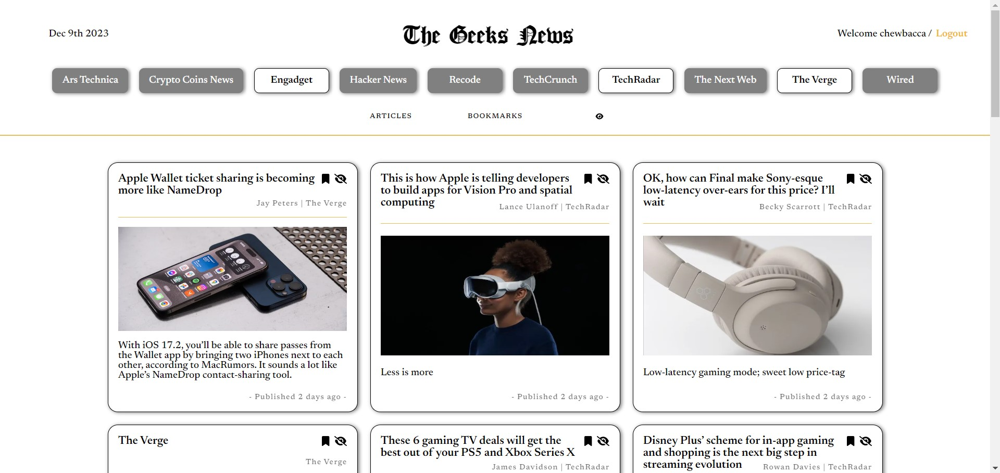

# Geeks News | Frontend

Welcome to the Geeks News!

The Geeks News application is a platform that provides news about the world of technology, with the ability to save articles as favorites and hide specific articles. Explore the latest technology news and customize your reading experience.

> This is the frontend of the project created as part of my portfolio to showcase my web development skills.

Want to see the backend? it's [here](https://github.com/chewbacca234/geeks-news_backend.git).

Have fun using it!

## 🛠️ Tech Stack

- [React](https://reactjs.org/)
- [Next.js](https://nextjs.org/)
- [Ant Design](https://ant.design/)
- [Redux Persist](https://www.npmjs.com/package/redux-persist)
- [Redux](https://react-redux.js.org/)
- [Moment](https://momentjs.com/)

## 💻 View in production

1. Go to [Geeks News](https://geeks-news.vercel.app/).
2. Choose some sources to view their top headlines articles.

3. Create an account to bookmark articles.
4. You can hide some articles by clicking the eye icon.

## 📰 License

Distributed under the MIT License. See [LICENSE.txt](./LICENCE.txt) for more information.
